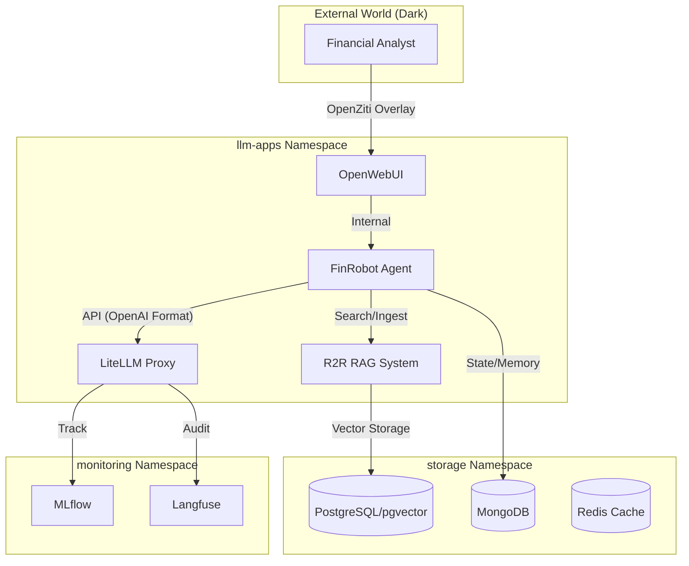

# FinRobot Integration Guide: Secure Financial LLMOps Infrastructure

This document outlines the architecture and integration steps for deploying **FinRobot** as an AI Agent within the `gitops_internal_lgcorzo` infrastructure.

## 1. Overview

FinRobot is integrated as a high-performance financial agent in the **llm-apps** namespace. It leverages a "Dark" infrastructure secured by **OpenZiti**, managed via **FluxCD (GitOps)**, and connected to a robust LLMOps stack.

### Key Integration Points:

- **LiteLLM Proxy**: Unified access to LLM providers with governance and tracking.
- **R2R RAG System**: Retrieval Augmented Generation powered by PostgreSQL and pgvector.
- **MongoDB**: Persistent memory and state management for agents.
- **Hatchet**: High-reliability workflow orchestration for complex financial tasks.
- **MLflow / Langfuse**: Observability and experiment tracking.

---

## 2. Infrastructure Architecture

The following diagram illustrates how FinRobot interacts with the core LLMOps components:



---

## 3. Deployment Configuration

### Namespace & Security

- **Namespace**: `llm-apps`
- **Identity**: FinRobot uses an OpenZiti identity to communicate with other services securely without exposed ports.
- **Secrets**: Managed via **Sealed Secrets** in the `gitops_internal_lgcorzo` repository.

### Internal Service Endpoints

| Service            | Internal URL                                         | Port  |
| :----------------- | :--------------------------------------------------- | :---- |
| **LiteLLM**        | `http://litellm.llm-apps.svc.cluster.local`          | 80    |
| **R2R API**        | `http://r2r.llm-apps.svc.cluster.local`              | 7272  |
| **MongoDB**        | `http://mongodb.storage.svc.cluster.local`           | 27017 |
| **Hatchet Engine** | `http://hatchet-api.orchestrators.svc.cluster.local` | 8080  |

---

## 4. FinRobot Configuration

To connect FinRobot to the infrastructure, configure the `OAI_CONFIG_LIST` and environment variables as follows:

### OAI_CONFIG_LIST (LiteLLM Integration)

```json
[
  {
    "model": "azure-gpt",
    "api_base": "http://litellm.llm-apps.svc.cluster.local/v1",
    "api_key": "${LITELLM_KEY}",
    "price": [0.03, 0.06]
  },
  {
    "model": "lite_embedding",
    "api_base": "http://litellm.llm-apps.svc.cluster.local/v1",
    "api_key": "${LITELLM_KEY}"
  }
]
```

### Environment Variables (Sealed Secrets)

| Variable               | Description                         | Source            |
| :--------------------- | :---------------------------------- | :---------------- |
| `LITELLM_KEY`          | Virtual key for LiteLLM access      | `litellm-secrets` |
| `R2R_API_KEY`          | Authorization for R2R RAG queries   | `r2r-secrets`     |
| `MONGODB_URI`          | Connection string for MongoDB state | `mongodb-secrets` |
| `HATCHET_CLIENT_TOKEN` | Token for workflow orchestration    | `hatchet-secrets` |

---

## 5. Security & Governance

### Zero Trust Networking

FinRobot does not expose any listening ports. All "North-South" and "East-West" traffic is handled by the **OpenZiti** identity sidecar. This ensures that even if a pod is compromised, the attacker cannot scan the network or reach other services without valid cryptographic identities.

### Financial Compliance

- **LLM Logs**: All queries and responses are logged to **Langfuse** for auditing and compliance.
- **Model Tracking**: Performance and latency are monitored in **MLflow**.
- **Data Privacy**: RAG data (Postgres) and Agent memory (MongoDB) are encrypted at rest and in transit (mTLS).

---

## 6. Maintenance & Updates (GitOps)

All configuration changes must be made in the `gitops_internal_lgcorzo` repository:

1. Update manifests in `infrastructure/llm-apps/finrobot/`.
2. Commit and push to the `main` branch.
3. **FluxCD** will automatically reconcile and apply the changes to the cluster.
