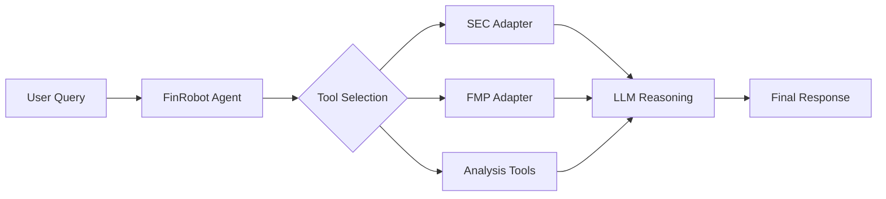

# Agents Stories

This document describes the AI Agent implementation using the Microsoft Agent Framework.

## Overview

FinRobot uses the **Microsoft Agent Framework** for building intelligent financial analysis agents. Agents combine LLM reasoning with specialized tools to perform complex financial tasks.

## Location

```
src/finrobot/models/agents/
├── __init__.py
├── workflow.py          # Agent orchestration (FinRobot, SingleAssistant)
├── prompts.py           # System prompts and templates
├── utils.py             # Agent utility functions
├── services/
│   ├── workflow_service.py   # Workflow service implementation
│   └── prompt_service.py     # Prompt management
└── tools/
    └── registry.py      # Tool registration and management
```

## Key Agent Classes

### FinRobot

The main agent class that orchestrates financial analysis:

```python
from finrobot.models.agents.workflow import FinRobot

agent = FinRobot(
    name="Financial_Analyst",
    llm_config={"model": "gpt-4"},
)
await agent.run("Analyze AAPL's latest 10-K filing")
```

### SingleAssistant

A simplified agent for single-task operations:

```python
from finrobot.models.agents.workflow import SingleAssistant

assistant = SingleAssistant(
    "Market_Analyst",
    llm_config,
    human_input_mode="NEVER",
)
assistant.chat("Predict NVDA stock movement for next week")
```

### SingleAssistantRAG

An agent with Retrieval-Augmented Generation capabilities:

```python
from finrobot.models.agents.workflow import SingleAssistantRAG

rag_agent = SingleAssistantRAG(
    "Earnings_Analyst",
    llm_config,
    documents=earnings_transcripts,
)
```

## Agent Workflow



## Financial Chain-of-Thought (CoT)

Agents use specialized CoT prompting for financial reasoning:

1. **Gather Data**: Retrieve relevant financial data
2. **Analyze**: Apply financial analysis frameworks
3. **Synthesize**: Combine insights into coherent narrative
4. **Recommend**: Provide actionable recommendations
