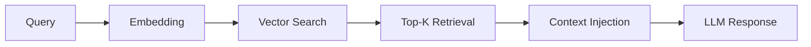

# RAG Stories

This document describes the Retrieval-Augmented Generation (RAG) capabilities for financial document analysis.

## Overview

The RAG module enables semantic search and question-answering over financial documents, particularly earnings call transcripts and SEC filings.

## Location

```
src/finrobot/functional/
├── rag.py               # RAG pipeline implementation
└── ragquery.py          # Query interface for RAG
```

## Key Components

### RAG Pipeline

```python
from finrobot.functional.rag import RAGPipeline

# Initialize pipeline
rag = RAGPipeline(
    documents=earnings_transcripts,
    embedding_model="text-embedding-ada-002",
    chunk_size=1000,
)

# Query
result = rag.query(
    "What did management say about revenue guidance for Q4?"
)
```

### Earnings Query Interface

```python
from finrobot.functional.ragquery import query_earnings_transcripts

# Query earnings calls
answer = query_earnings_transcripts(
    ticker="AAPL",
    quarter="Q3 2023",
    question="What are the key growth drivers mentioned?"
)
```

## Document Types Supported

| Document Type  | Source            |
| -------------- | ----------------- |
| Earnings Calls | API / Transcripts |
| 10-K Filings   | SEC EDGAR         |
| 10-Q Filings   | SEC EDGAR         |
| 8-K Filings    | SEC EDGAR         |
| S-1 Filings    | SEC EDGAR         |

## RAG Workflow



## Use Cases

1. **Earnings Analysis**: Extract management commentary on specific topics
2. **Risk Discovery**: Find risk factors mentioned in filings
3. **Guidance Tracking**: Track revenue/earnings guidance over time
4. **Competitive Analysis**: Compare mentions across companies
