# System Architecture Review (SAR)

## FinRobot - AI Agent Platform for Financial Analysis

**Version:** 1.0  
**Date:** January 2026  
**Status:** Approved

---

## 1. Executive Summary

This document provides a comprehensive architectural review of FinRobot, detailing the system's structure, component interactions, deployment model, and design decisions.

---

## 2. System Context

### 2.1 Context Diagram

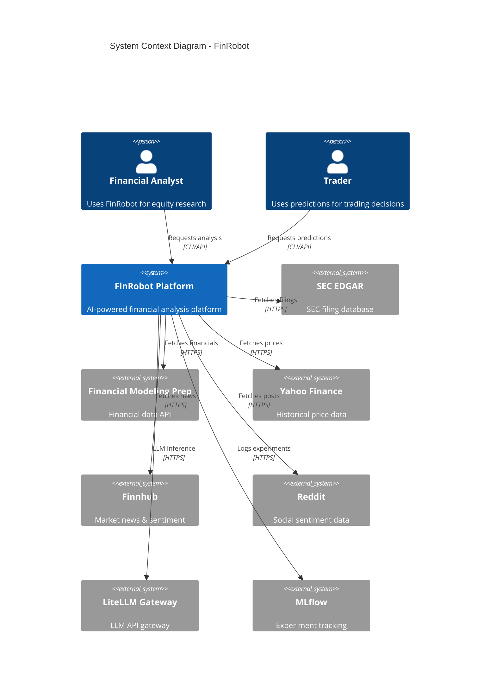

---

## 3. Container Architecture

### 3.1 Container Diagram

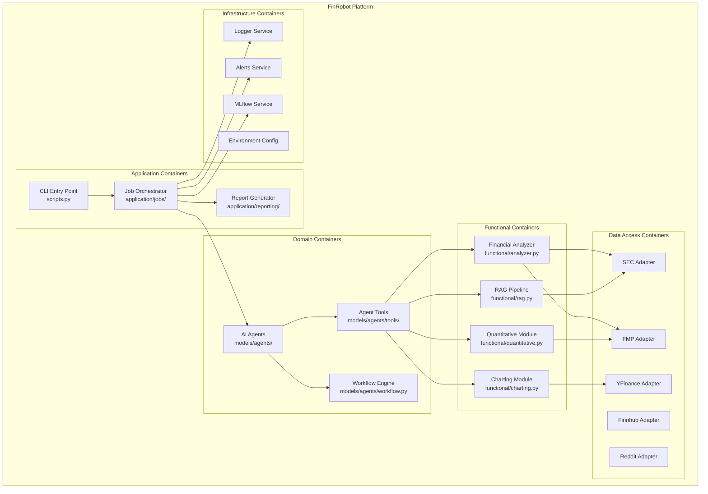

---

## 4. Component Architecture

### 4.1 Domain Layer Components

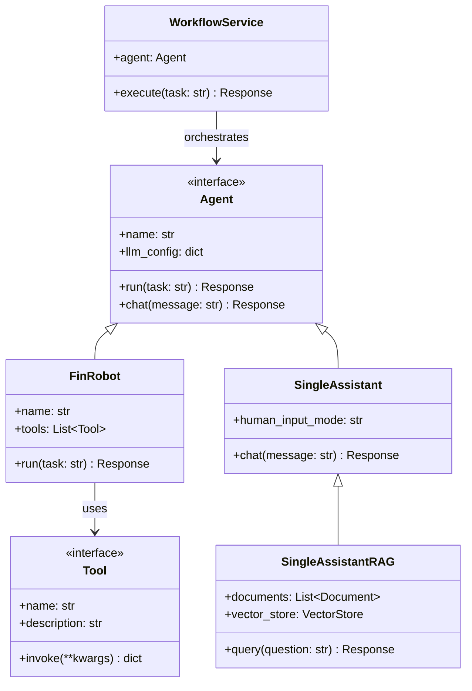

### 4.2 Data Access Layer Components

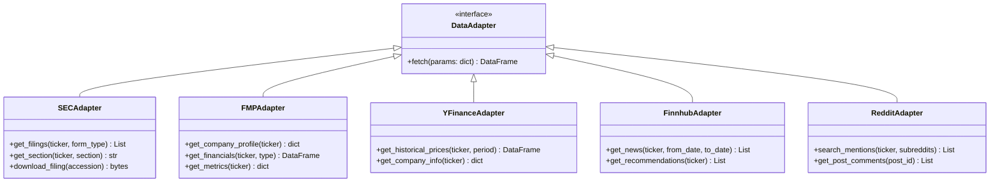

### 4.3 Application Layer Components

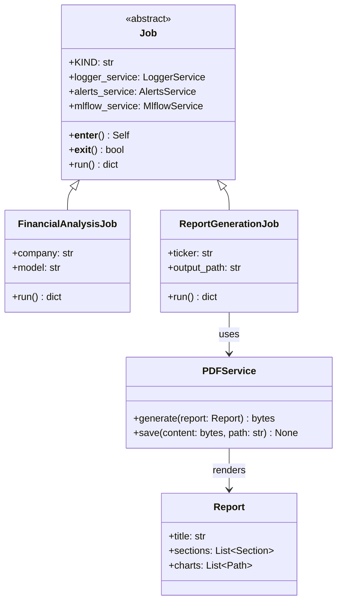

---

## 5. Interaction Diagrams

### 5.1 Full Analysis Workflow

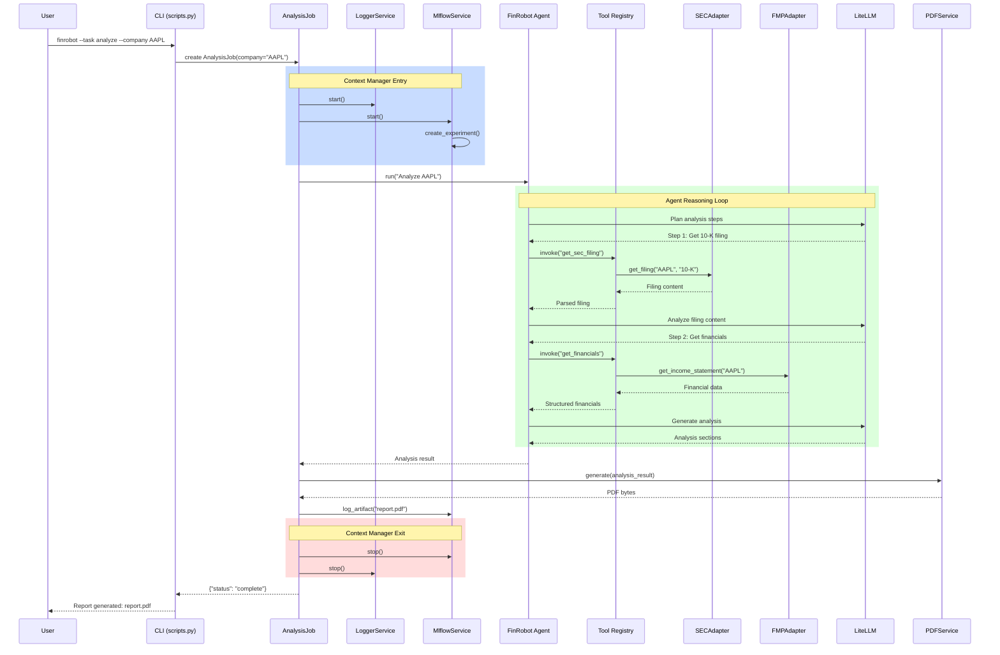

### 5.2 RAG Query Workflow

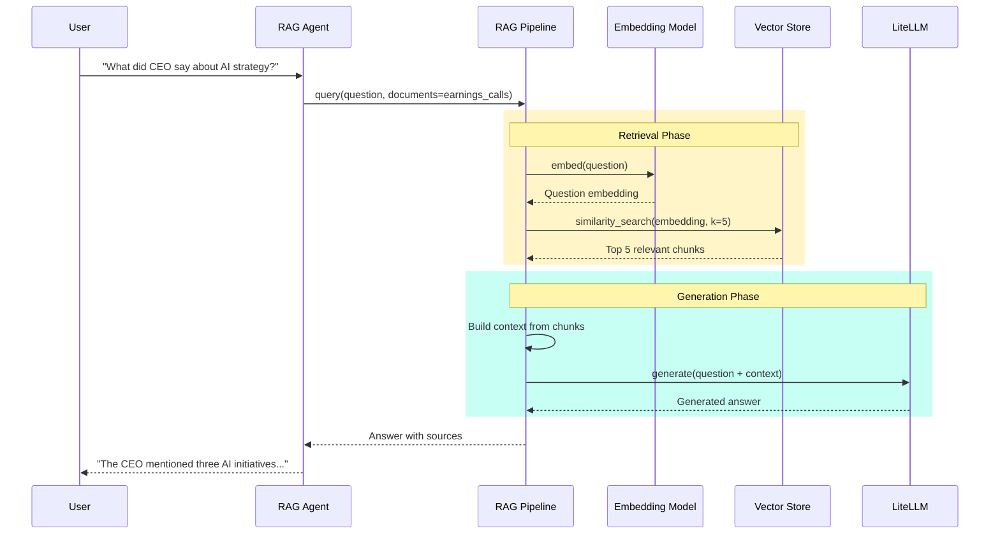

### 5.3 Multi-Agent Collaboration (Future)

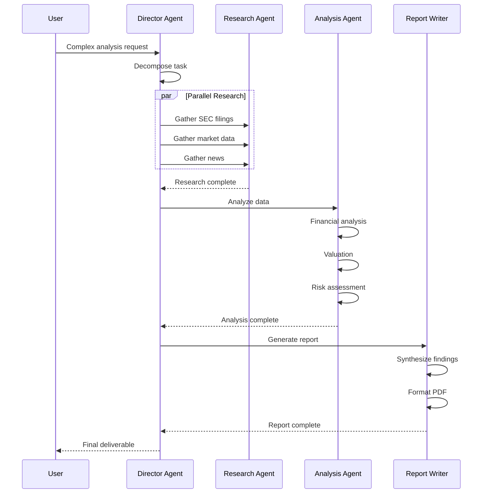

---

## 6. Deployment Architecture

### 6.1 Kubernetes Deployment

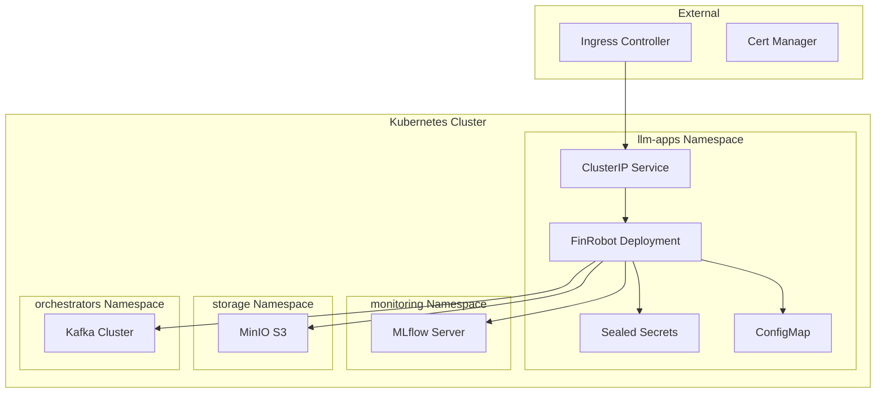

### 6.2 Pod Specification

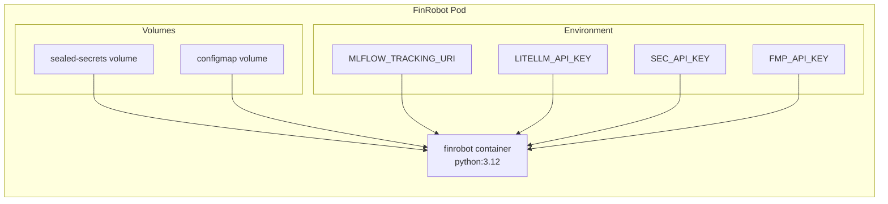

---

## 7. Data Flow Architecture

### 7.1 Data Flow Diagram

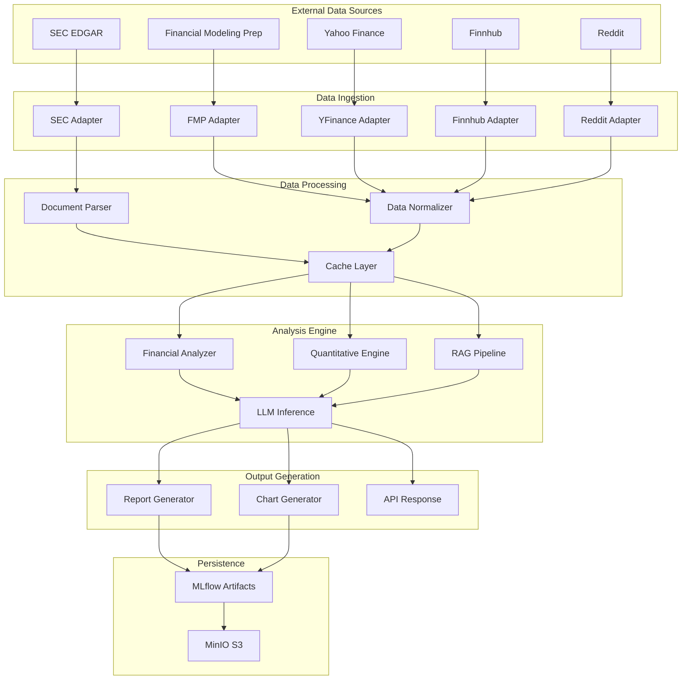

---

## 8. Security Architecture

### 8.1 Secrets Management

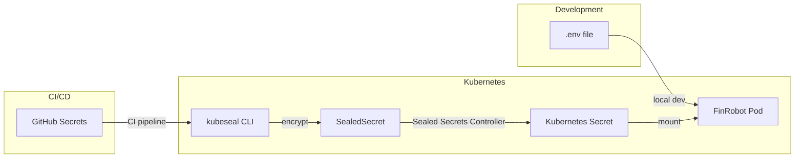

### 8.2 API Authentication Flow

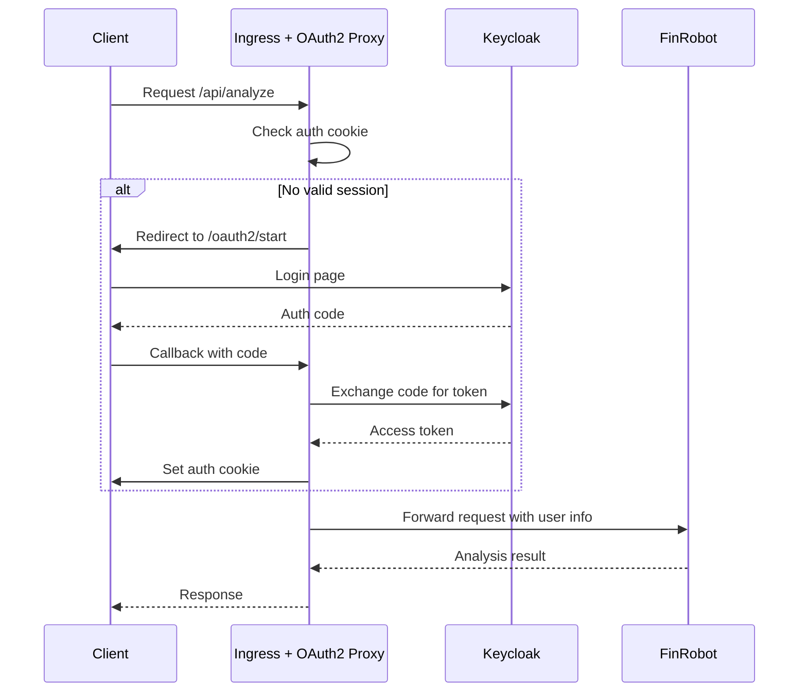

---

## 9. Technology Stack

| Layer                   | Technology                | Purpose                      |
| ----------------------- | ------------------------- | ---------------------------- |
| **Runtime**             | Python 3.12               | Core language                |
| **Agent Framework**     | Microsoft Agent Framework | AI agent orchestration       |
| **LLM Gateway**         | LiteLLM                   | Multi-provider LLM routing   |
| **Configuration**       | Pydantic Settings         | Type-safe config             |
| **Experiment Tracking** | MLflow                    | Model versioning, artifacts  |
| **PDF Generation**      | ReportLab                 | Professional reports         |
| **Charting**            | Matplotlib, mplfinance    | Financial visualizations     |
| **Testing**             | pytest, coverage          | 94%+ test coverage           |
| **Container**           | Docker, Kubernetes        | Deployment                   |
| **Secrets**             | Bitnami Sealed Secrets    | Secure credential management |
| **Storage**             | MinIO S3                  | Artifact storage             |

---

## 10. Design Decisions

### DD-001: DDD Architecture

**Decision:** Adopt Domain-Driven Design with clear layer separation.

**Rationale:**

- Clear boundaries between business logic and infrastructure
- Easier testing with dependency inversion
- Scalable team organization

### DD-002: Microsoft Agent Framework

**Decision:** Migrate from AutoGen to Microsoft Agent Framework.

**Rationale:**

- Better type safety and Pydantic integration
- Cleaner async patterns
- More flexible tool registration

### DD-003: Sealed Secrets for Kubernetes

**Decision:** Use Bitnami Sealed Secrets instead of plain Kubernetes Secrets.

**Rationale:**

- Secrets can be safely committed to Git
- Encryption at rest with cluster-specific keys
- GitOps-compatible workflow
