# Software Requirements Specification (SRS)

## FinRobot - AI Agent Platform for Financial Analysis

**Version:** 1.0  
**Date:** January 2026  
**Status:** Approved

---

## 1. Introduction

### 1.1 Purpose

This document specifies the software requirements for FinRobot, an AI Agent Platform for Financial Analysis using Large Language Models. It defines functional and non-functional requirements for all system components.

### 1.2 Scope

FinRobot provides automated financial analysis capabilities including:

- SEC filing analysis
- Market data aggregation
- Financial statement analysis
- Equity research report generation
- Sentiment analysis from social media

### 1.3 System Overview

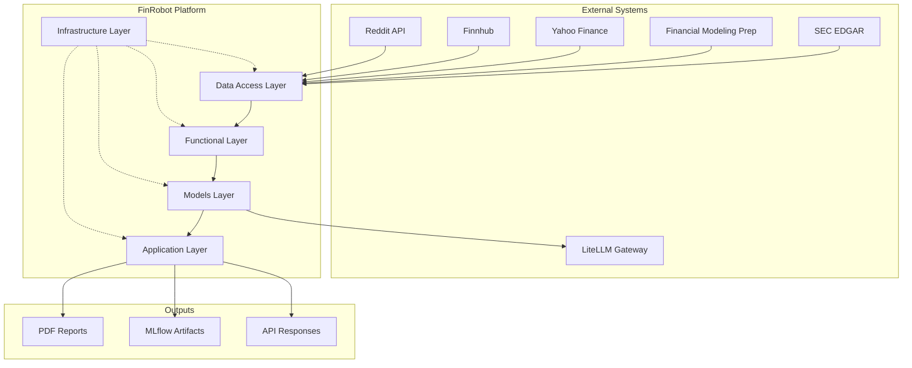

---

## 2. Functional Requirements

### 2.1 Data Retrieval (FR-100)

#### FR-101: SEC Filing Retrieval

| ID              | FR-101                                                                             |
| --------------- | ---------------------------------------------------------------------------------- |
| **Name**        | SEC Filing Retrieval                                                               |
| **Priority**    | High                                                                               |
| **Description** | System shall retrieve SEC filings (10-K, 10-Q, 8-K, S-1) for any public US company |

**Execution Flow:**

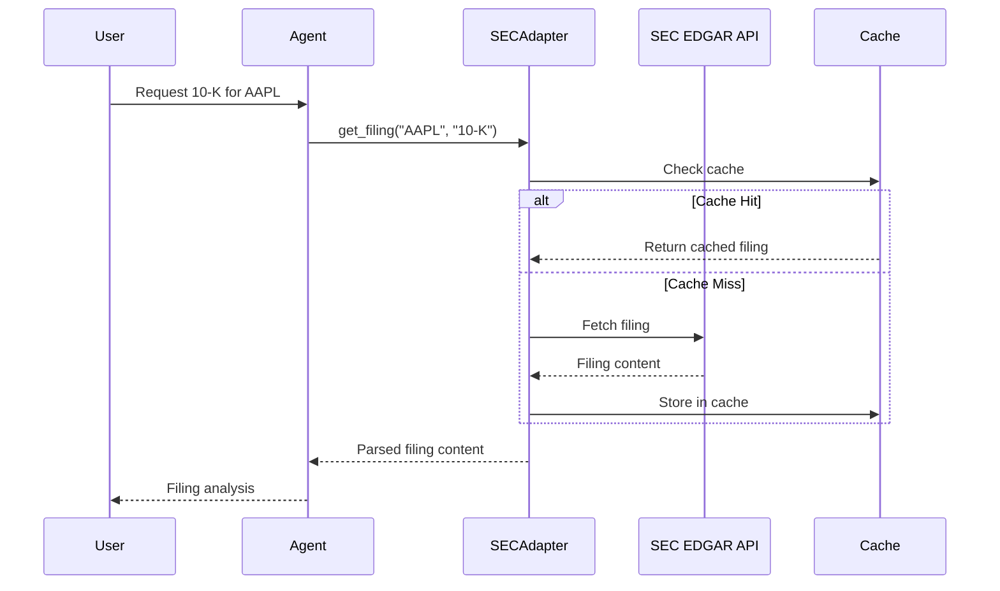

**Acceptance Criteria:**

- [ ] Retrieve filings by ticker symbol
- [ ] Support 10-K, 10-Q, 8-K, S-1 form types
- [ ] Extract specific sections (Risk Factors, MD&A, etc.)
- [ ] Handle rate limiting gracefully

---

#### FR-102: Market Data Retrieval

| ID              | FR-102                                                     |
| --------------- | ---------------------------------------------------------- |
| **Name**        | Market Data Retrieval                                      |
| **Priority**    | High                                                       |
| **Description** | System shall retrieve real-time and historical market data |

**Data Sources Interaction:**

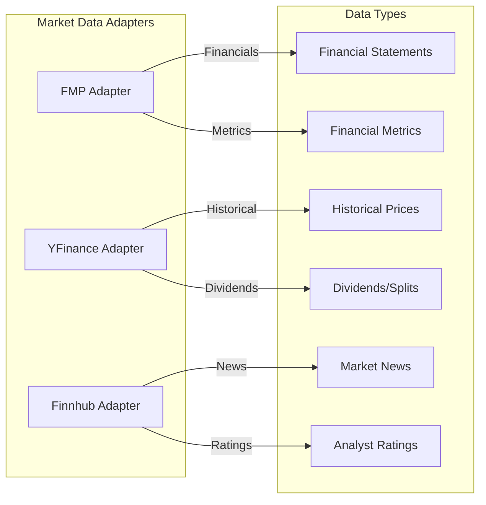

---

#### FR-103: Social Sentiment Retrieval

| ID              | FR-103                                                             |
| --------------- | ------------------------------------------------------------------ |
| **Name**        | Social Sentiment Retrieval                                         |
| **Priority**    | Medium                                                             |
| **Description** | System shall collect and analyze social media sentiment for stocks |

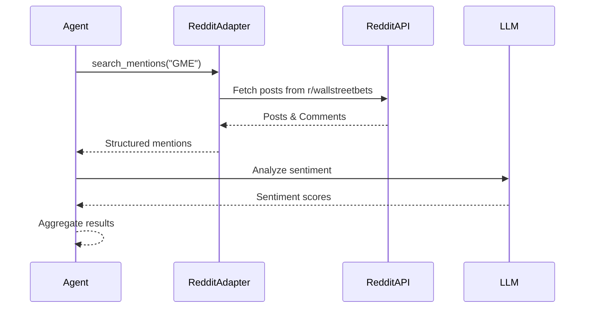

---

### 2.2 Analysis Functions (FR-200)

#### FR-201: Financial Statement Analysis

| ID              | FR-201                                                                 |
| --------------- | ---------------------------------------------------------------------- |
| **Name**        | Financial Statement Analysis                                           |
| **Priority**    | High                                                                   |
| **Description** | System shall analyze income statements, balance sheets, and cash flows |

**Analysis Pipeline:**

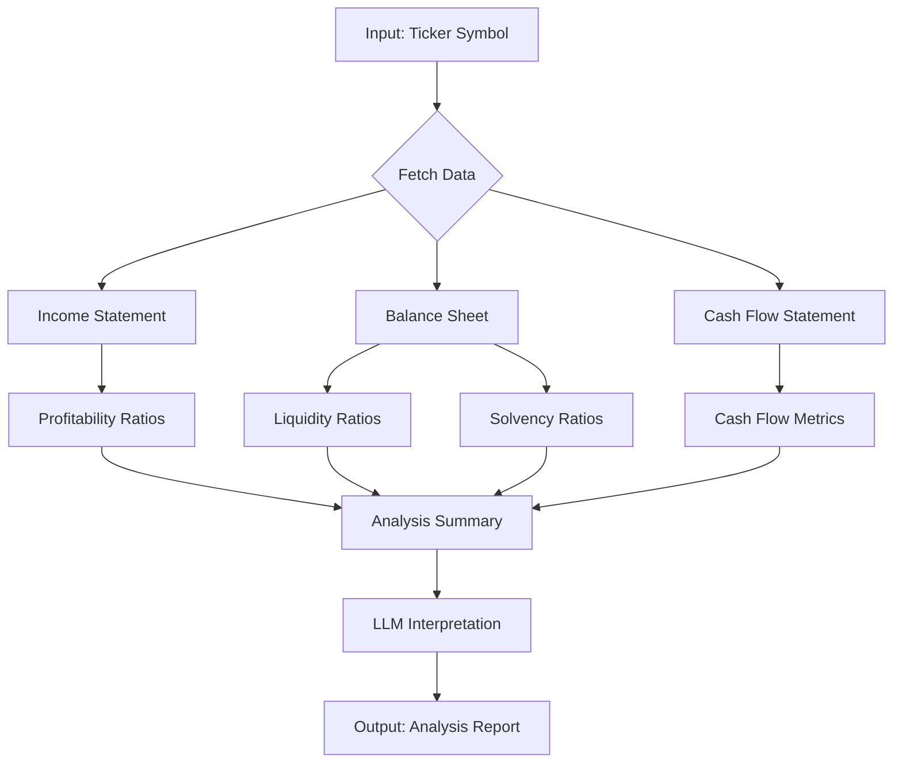

**Computed Metrics:**

| Category      | Metrics                                              |
| ------------- | ---------------------------------------------------- |
| Profitability | Gross Margin, Operating Margin, Net Margin, ROE, ROA |
| Liquidity     | Current Ratio, Quick Ratio, Cash Ratio               |
| Solvency      | Debt/Equity, Interest Coverage, Debt/EBITDA          |
| Valuation     | P/E, P/B, EV/EBITDA, PEG                             |

---

#### FR-202: Valuation Analysis

| ID              | FR-202                                                   |
| --------------- | -------------------------------------------------------- |
| **Name**        | Valuation Analysis                                       |
| **Priority**    | High                                                     |
| **Description** | System shall perform DCF and comparable company analysis |

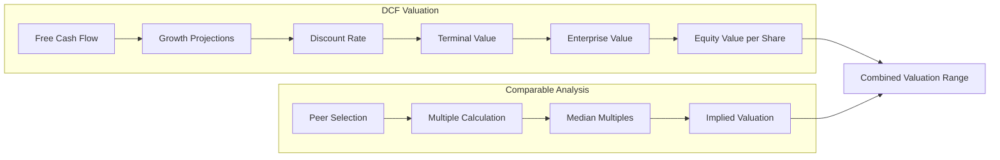

---

### 2.3 AI Agent Functions (FR-300)

#### FR-301: Agent Workflow Execution

| ID              | FR-301                                                             |
| --------------- | ------------------------------------------------------------------ |
| **Name**        | Agent Workflow Execution                                           |
| **Priority**    | High                                                               |
| **Description** | System shall execute multi-step analysis workflows using AI agents |

**Agent Execution Model:**

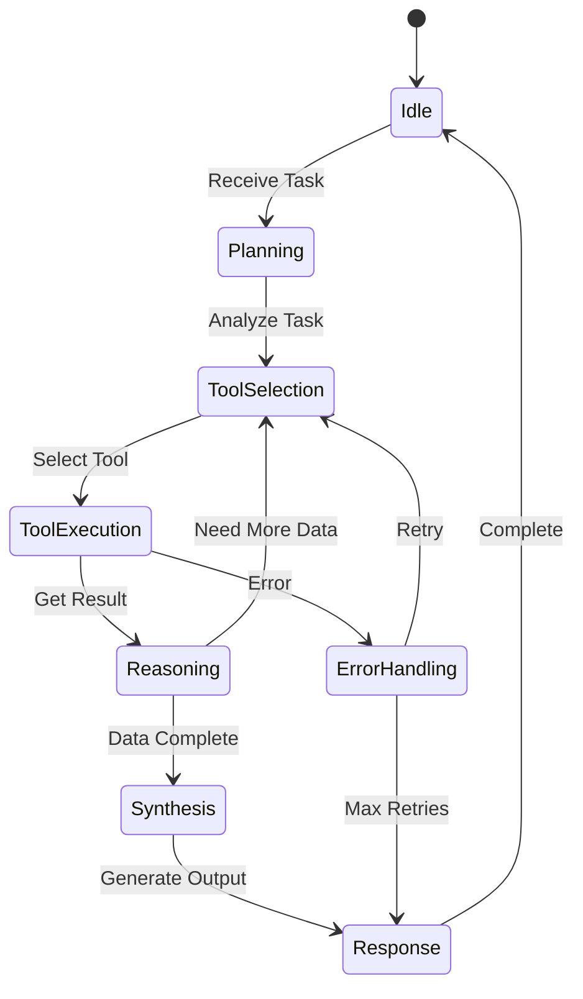

---

#### FR-302: Tool Invocation

| ID              | FR-302                                                                       |
| --------------- | ---------------------------------------------------------------------------- |
| **Name**        | Tool Invocation                                                              |
| **Priority**    | High                                                                         |
| **Description** | Agents shall invoke registered tools to access data and perform computations |

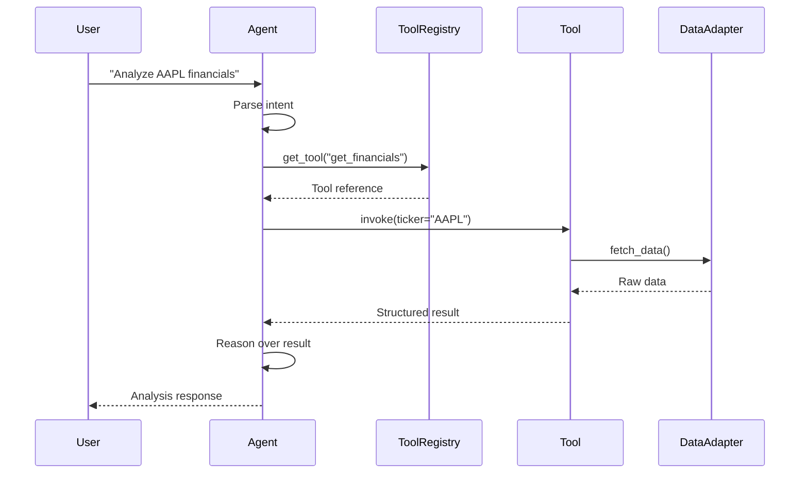

---

### 2.4 Report Generation (FR-400)

#### FR-401: PDF Report Generation

| ID              | FR-401                                                                   |
| --------------- | ------------------------------------------------------------------------ |
| **Name**        | PDF Report Generation                                                    |
| **Priority**    | High                                                                     |
| **Description** | System shall generate professional equity research reports in PDF format |

**Report Generation Flow:**

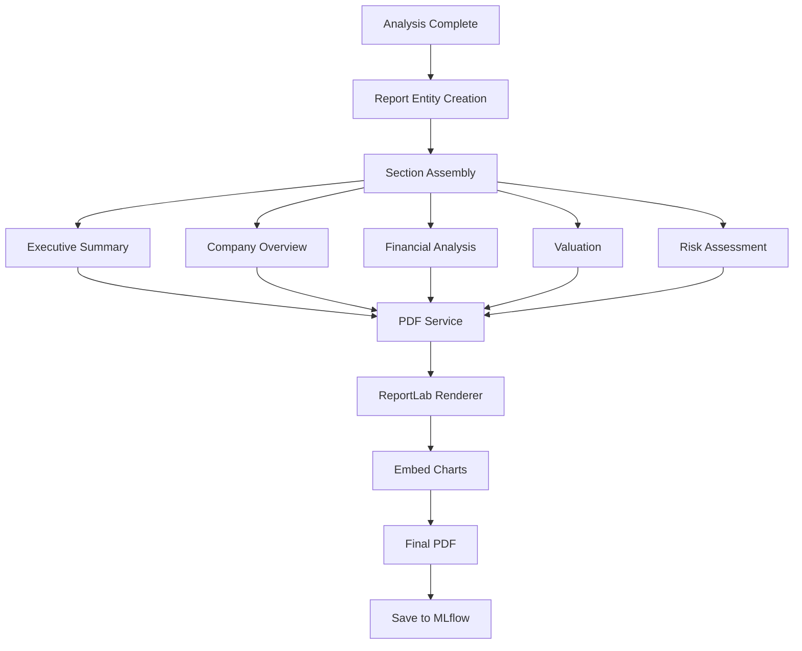

---

## 3. Non-Functional Requirements

### 3.1 Performance (NFR-100)

| ID      | Requirement       | Target                            |
| ------- | ----------------- | --------------------------------- |
| NFR-101 | API response time | < 5 seconds for data retrieval    |
| NFR-102 | Report generation | < 30 seconds for full report      |
| NFR-103 | Agent response    | < 60 seconds for complex analysis |

### 3.2 Reliability (NFR-200)

| ID      | Requirement    | Target                            |
| ------- | -------------- | --------------------------------- |
| NFR-201 | Service uptime | 99.5% availability                |
| NFR-202 | Data accuracy  | 99.9% accuracy for financial data |
| NFR-203 | Error recovery | Automatic retry with backoff      |

### 3.3 Security (NFR-300)

| ID      | Requirement     | Target                        |
| ------- | --------------- | ----------------------------- |
| NFR-301 | API key storage | Kubernetes Sealed Secrets     |
| NFR-302 | Data encryption | TLS 1.3 for all external APIs |
| NFR-303 | Access control  | Role-based access via OAuth2  |

### 3.4 Scalability (NFR-400)

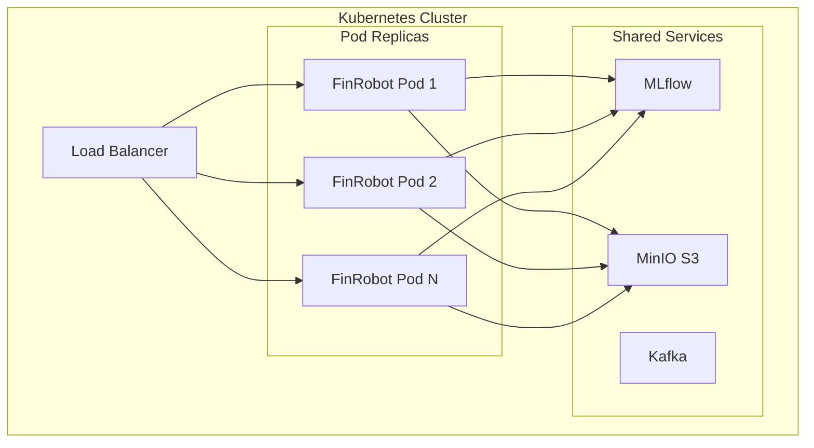

---

## 4. Use Cases

### UC-001: Generate Equity Research Report

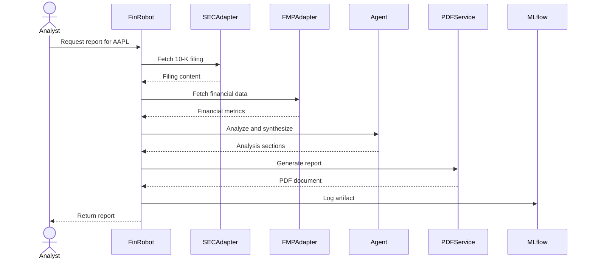

### UC-002: Predict Stock Movement

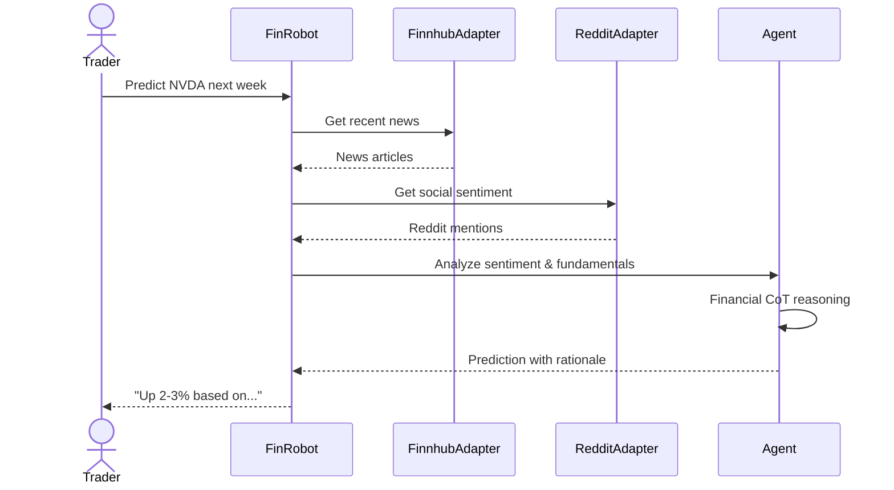

---

## 5. Traceability Matrix

| Requirement | Component                           | Test Coverage          |
| ----------- | ----------------------------------- | ---------------------- |
| FR-101      | `sec_adapter.py`                    | `test_sec_adapter.py`  |
| FR-102      | `fmp_utils.py`, `yfinance_utils.py` | `test_fmp_utils.py`    |
| FR-103      | `reddit_utils.py`                   | `test_reddit_utils.py` |
| FR-201      | `analyzer.py`, `quantitative.py`    | `test_analyzer.py`     |
| FR-202      | `quantitative.py`                   | `test_quantitative.py` |
| FR-301      | `workflow.py`                       | `test_workflow.py`     |
| FR-302      | `registry.py`                       | `test_tools.py`        |
| FR-401      | `pdf_service.py`                    | `test_pdf_service.py`  |
