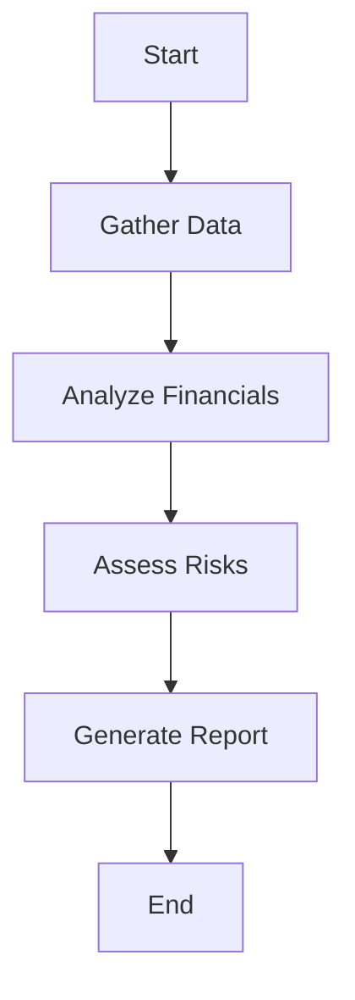

# Workflows Stories

This document describes agent workflow orchestration patterns in FinRobot.

## Overview

Workflows define how agents collaborate and execute multi-step financial analysis tasks. The workflow module handles agent coordination, state management, and result aggregation.

## Location

```
src/finrobot/models/agents/
├── workflow.py              # Main workflow definitions
└── services/
    └── workflow_service.py  # Workflow service implementation
```

## Workflow Patterns

### Single Agent Workflow

For straightforward tasks handled by one agent:

```python
from finrobot.models.agents.workflow import SingleAssistant

agent = SingleAssistant("Analyst", llm_config)
result = agent.chat("What is AAPL's P/E ratio?")
```

### Multi-Step Analysis Workflow

For complex tasks requiring sequential steps:



### Report Generation Workflow

The full equity research report workflow:

1. **Data Collection**: SEC filings, market data, news
2. **Financial Analysis**: Statement analysis, ratio calculation
3. **Valuation**: DCF, peer comparison, multiples
4. **Risk Assessment**: Identify key risks
5. **Report Synthesis**: Combine into PDF report

## Configuration

Workflow behavior is controlled via `llm_config`:

```python
llm_config = {
    "config_list": [{"model": "gpt-4", "api_key": "..."}],
    "timeout": 120,
    "temperature": 0.5,
}
```

## Human-in-the-Loop

Workflows support human interaction modes:

| Mode        | Description                |
| ----------- | -------------------------- |
| `NEVER`     | Fully autonomous execution |
| `TERMINATE` | Human approval at end      |
| `ALWAYS`    | Interactive chat mode      |
